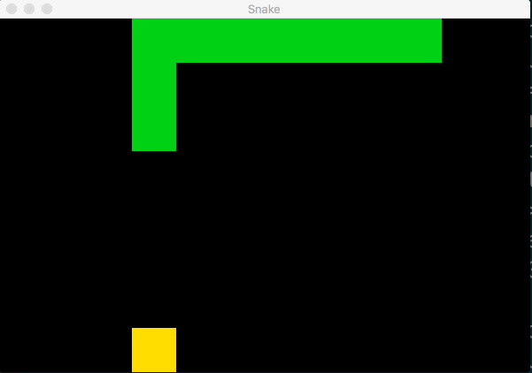

# Ruby Snake :snake:

In this repository you will find the snake game made in the Ruby language using the Flux architecture.

# Demo



## Composition

```
├── Gemfile
├── Gemfile.lock
├── README.md
├── assets
│   └── snake_demo.gif
├── src
│   ├── actions
│   │   └── actions.rb
│   ├── app.rb
│   ├── model
│   │   └── state.rb
│   └── view
│       └── ruby2d.rb
└── tests
    └── actions_test.rb
```

- App: The entry point of the project.
- Ruby2D: It is the view that I implement using Ruby2D
- Timer: It's inside the app, it's that send the movement to snake.
- Actions: It is where the logic that modifies the state.
- State: The state of the application.

## Contributing :raising_hand:

The project is open to changes or suggestions. Constructive criticism of any kind is welcome.

## Requeriments

- Ruby 2.7.0
- Bundler `gem install bundler`

## Installation :electric_plug:

Clone ruby_snake:

```
git clone https://github.com/matiaschiodo/ruby-snake.git
```

Install gems:

```
bundle install
```

Start app:

```
bundle exec ruby src/app.rb
```

## License :unlock:

Copyright © 2022 [Matias Chiodo](https://github.com/matiaschiodo)

This project is [MIT](https://choosealicense.com/licenses/mit/) licensed
